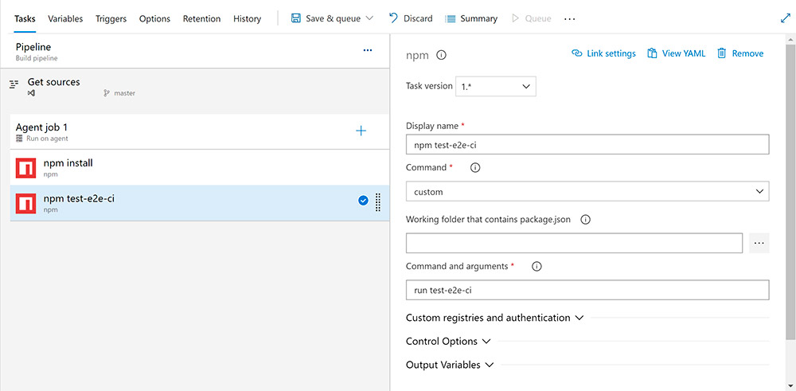

End-to-end tests are useful for simulating and validating a real user scenario. It is even more useful if you can automate these tests in a continuous integration service like Travis CI or Azure Devops. This post will mostly focus on Azure Devops.

<a href="https://github.com/marcveens/e2e-ci-tests" target="_blank" rel="noopener noreferrer">Example GitHub repository</a>

You can download the example project to see a really basic implementation of two E2E tests and the required scripts to run it in a CI build pipeline. 

## How it works
The repository makes it possible to run end-to-end tests on a build agent using your create-react-app localhost production environment. 

The most important command is `test-e2e-ci`. That's the one that should be run on a CI environment. It triggers a NodeJS script which performs the following actions:

1. Node runs `npm run build`
2. Node runs `npm run serve` which serves the built app on port 3000.
3. Node waits for port 3000 to become available. This means that the React app is running. 
4. `npm run test-e2e-ci-exec` will run and use localhost:3000 for the E2E tests
5. When a test fails, the build agent will also fail
6. No matter what the result is, all started processes will be killed gracefully.

## Used packages for E2E testing
| Package | Description |
|-|-|
| <a href="https://www.npmjs.com/package/jest" target="_blank" rel="noopener noreferrer">`jest`</a> | JavaScript testing framework |
| <a href="https://www.npmjs.com/package/puppeteer" target="_blank" rel="noopener noreferrer">`puppeteer`</a> | Node library which provides a high-level API to control Chrome or Chromium over the DevTools Protocol. Puppeteer runs headless by default, but can be configured to run full (non-headless) Chrome or Chromium. |
| <a href="https://www.npmjs.com/package/jest-puppeteer" target="_blank" rel="noopener noreferrer">`jest-puppeteer`</a> | Jest preset containing all required configuration for writing integration tests using Puppeteer. |

## Important npm commands
| Command | Description |
|-|-|
| `test-e2e` | Runs E2E tests in non-headless mode, thus it opens a browser for you. |
| `test-e2e-ci` | Runs E2E tests in a headless browser + runs `npm build` and `npm run serve` beforehand. |
| `test-e2e-ci-exec` | Runs E2E tests in a headless browser. Requires you to run `npm start` or `npm build` beforehand. |

## Configuring Azure Devops
It's actually quite easy to run the tests in Azure Devops. Only two steps are mandatory:

1. `npm install`
2. `npm run test-e2e-ci`

Which looks the folling in Azure Devops:

This should be enough to get a succesful result.

Cheers!